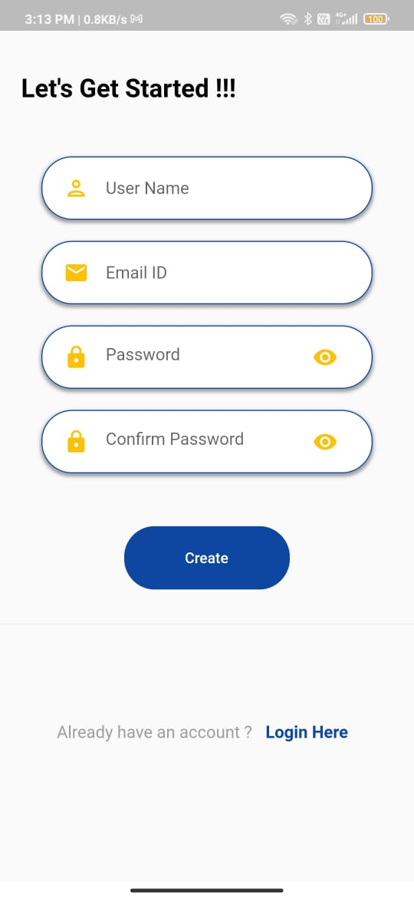
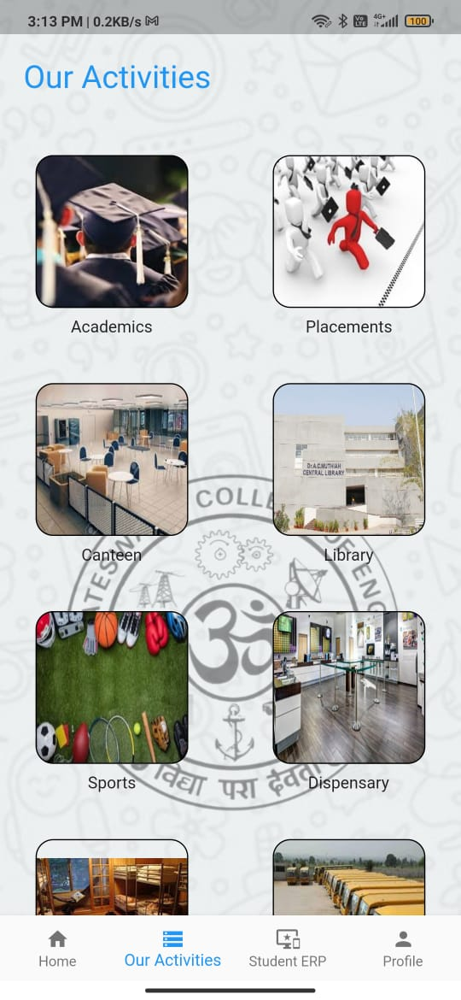
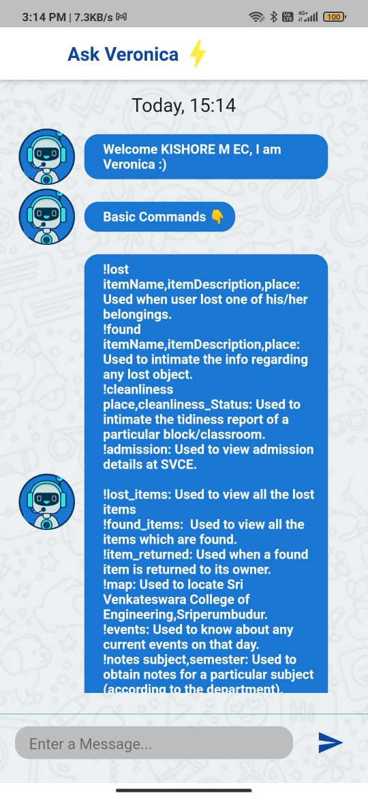
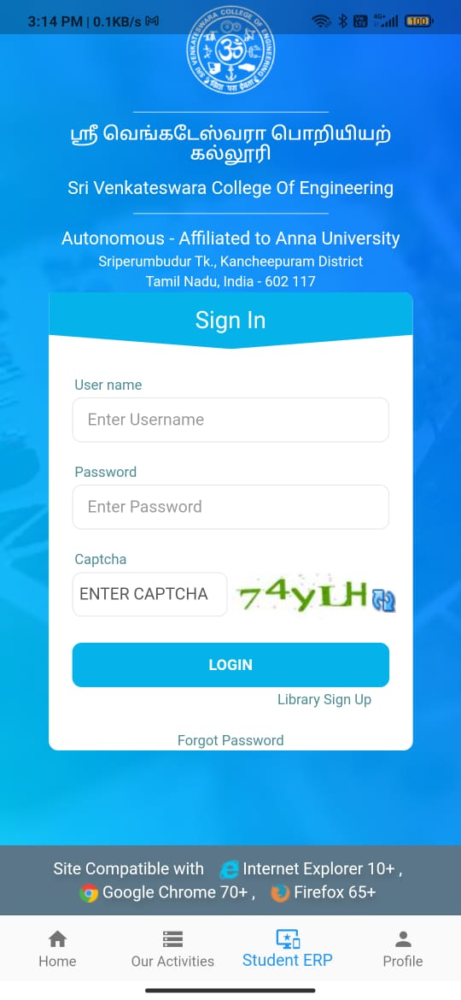
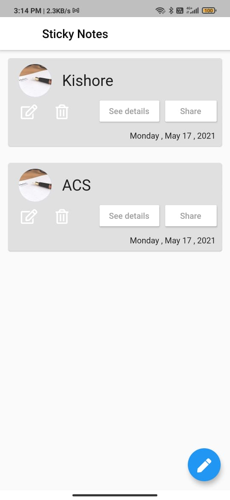
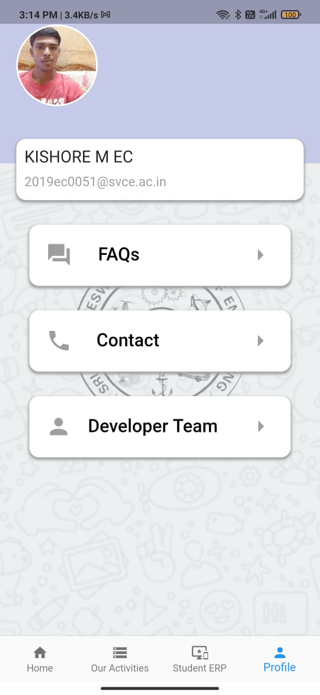

# SVCE Mobile

A Multi - Functional Flutter Application for SVCE Users.

## Project Abstract

 - **SVCE Mobile** is a application , which is used to provide regular updates on our college and to get notified with our activities and to provide necessary information to every user .

## Functionalities

 - Google Sign - In
 - Home Page 
 - Activities Section 
 - ERP Login 
 - Profile and Settings 
 - ChatBot For Enquiry 
 - Note Taker for Online Classes 
 - Canteen and Transport Info 
 - Food Recommendation System 

## Tech Stack 

 - Flutter and Dart ( SDK and ChatBot )
 - Firebase ( Google Auth , Cloud Firestore ) 
 - Python ( Data Processing ) 
 - Canva ( Basic UI ) 

## APIs and Libraries Used 

 - Google Fonts 
 - Carousel Pro
 - WebView 
 - Firebase Auth 
 - Firebase Core
 - Cloud Firestore
 - Font Awesome Flutter 
 - Flutter Share 
 - Flutter Provider 

## Upgrades To Be Done 

 - UI / UX needs to be changed . The plain UI needs to be converted to a colorful and dark UI .
 - ChatBot needs to get upgraded , to be more interactive and natural.
 - Email Login needs to be integrated 
 - Additional Data Processing needs to be done for increasing accuracy .

## Who Can Join ? 

 - Students , who are willing to learn some tech stuffs and passionate about Design and Flutter development can join us .
 - UI / UX designer  - ( Beginner / Advanced )
 - Flutter developer - ( Beginner / Advanced )
 - Python developer  - ( Beginner )
 - ChatBot developer - ( Advanced ) 

## Images 

